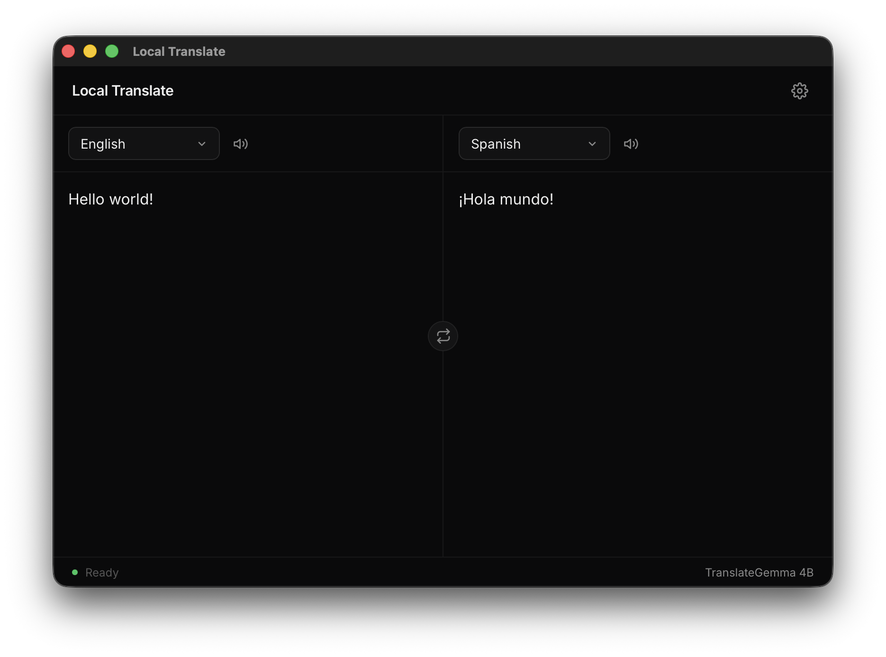
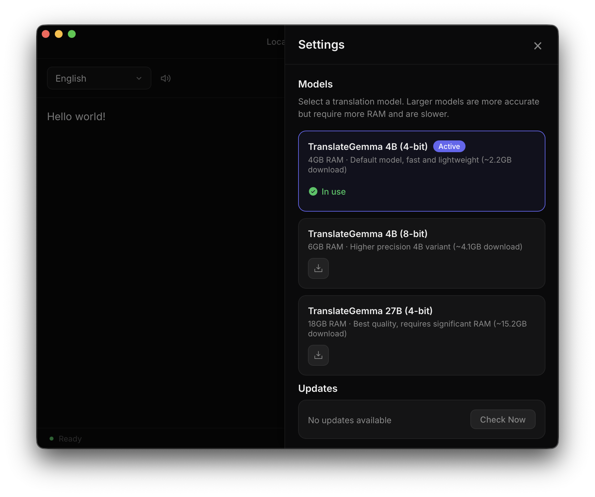

# Local Translate

Privacy-first, offline desktop translation app for macOS. All translation runs locally on your machine using [TranslateGemma](https://ai.google.dev/gemma/docs/core/translate_gemma) models accelerated by Apple Silicon — no data ever leaves your device.

<p align="center">
  
  
</p>

## Features

- **Fully offline** — no internet required after initial model download
- **79 languages** — powered by Google's TranslateGemma models
- **Multiple models** — choose between speed (4B) and accuracy (27B)
- **Text-to-speech** — optional Qwen3 TTS for 10 languages
- **GPU accelerated** — runs on Apple Silicon via MLX

## Install

### Homebrew

```sh
brew install fcjr/fcjr/local-translate
```

### Manual

Download the latest DMG from [Releases](https://github.com/fcjr/local-translate/releases).

## Models

| Model | RAM | Download Size |
|---|---|---|
| TranslateGemma 4B (4-bit) | 4 GB | ~2.2 GB |
| TranslateGemma 4B (8-bit) | 6 GB | ~4.1 GB |
| TranslateGemma 27B (4-bit) | 18 GB | ~15.2 GB |

Models are downloaded on first use and cached in `~/.cache/local-translate/`.

## Requirements

- macOS Ventura (13.0) or later
- Apple Silicon (M1 or later)

## Development

```bash
pnpm install
uv sync
pnpm tauri dev
```

Requires Node.js, Rust, and Python 3.10-3.12.

## License

[MIT](LICENSE)
